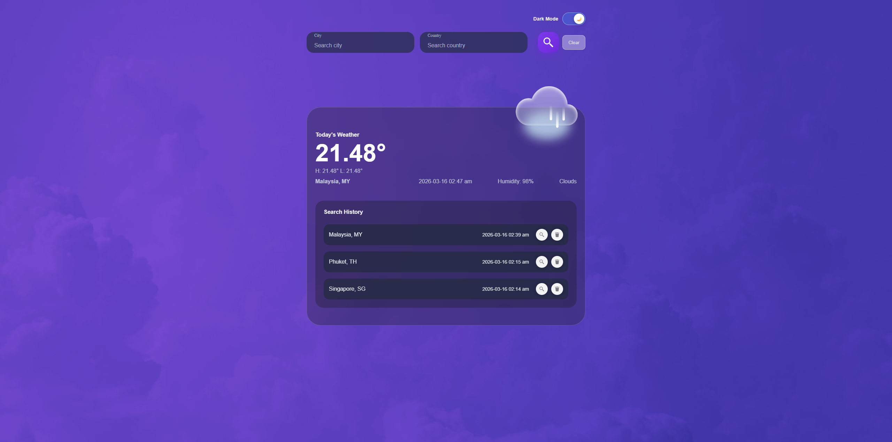
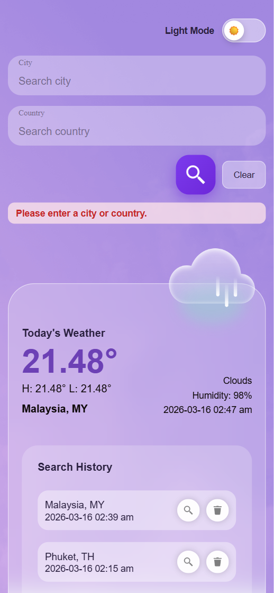
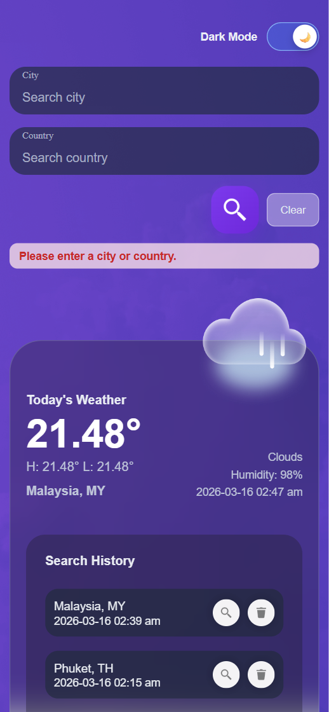

# Today's Weather

## Screenshots








A weather app built with React + TypeScript. It supports searching current weather by city/country, viewing local search history, deleting history records, and switching between light/dark themes.

## Features

- Search current weather by `City` / `Country`
- Display weather card information:
  - current temperature
  - high / low temperature
  - humidity
  - weather type
  - query time
  - city + country code
- Persist search history locally (`localStorage`)
- Re-search directly from history
- Delete history records (with confirmation dialog)
- Theme switch (Light / Dark)
- Error feedback (empty input, API errors, etc.)
- Responsive layout adaptation

## Tech Stack

- React 19
- TypeScript
- Vite
- Less + CSS Modules
- OpenWeather API

## Project Structure

```text
src/
  Component/
    SearchForm/       # Search inputs and action buttons
    WeatherCard/      # Current weather display card
    SearchHistory/    # History list + delete + re-search
    Switch/           # Theme toggle switch
  Pages/
    WeatherPage/
      index.tsx       # Page composition
      useWeatherData.tsx  # Page data logic (search/history/init)
      token.module.less    # Theme tokens
      index.module.less    # Page layout styles
  services/
    weather.ts        # API requests + history storage access
  interface/
    WeatherInterface.ts
```

## Environment Variables

Create a `.env` file in the project root:

```bash
VITE_OPEN_WEATHER_API_KEY=your_openweather_api_key
```

## Local Development

Install dependencies:

```bash
npm install
```

Start the dev server:

```bash
npm run dev
```